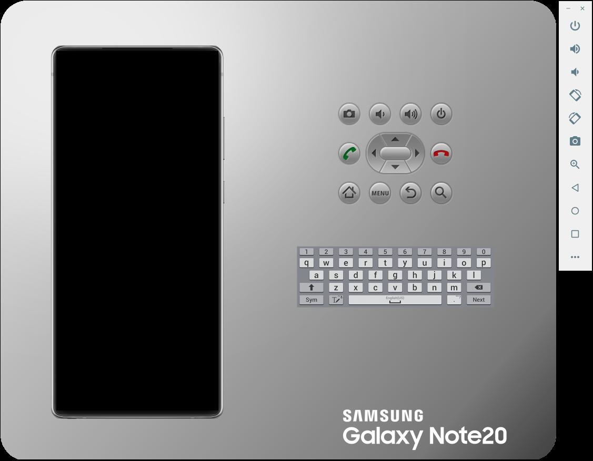

# Android Emulator Skins

Slimmed down Samsung's Emulator Skins!

Like most Android VM Skins, they can be too bulky around the edges. Samsung is no stranger to this despite having devices with beautiful trimmed edges, instead using a giant background with a full keyboard and additional buttons.

## Why do this?

If you're like me and you like slim and trim emulators, continue forward!

| Before | After |
|-|-|
|  | 

## Available Skins

### Progress

The converstion process is underway...

| Device            | Status |
|-------------------|--------|
| Note 10           | Ready
| Note 20 (Ultra)   | In Progress
| Galaxy Z Fold 3   | TBD
| Galaxy Z Flip 3   | TBD
| Galaxy Tab S7 (Plus) | TBD

### Device Specs

| Device          | Resolution  | DPI     | Display |
|-----------------|-------------|---------|---------|
| Note 10         | 1080 x 2280 | 401 ppi | 6.3"
| Note 10+        | 1440 x 3040 | 498 ppi | 6.8"
| Note 20         | 1080 x 2400 | 393 ppi | 6.7"
| Note 20 Ultra   | 1440 x 3088 | 496 ppi | 6.9"
| Galaxy Z Fold 3 | 1768 x 2208 | 374 ppi | 7.6"
| Galaxy Z Flip 3 | 1080 x 2640 | 426 ppi | 6.7"
| Galaxy Tab S7   | 1600 x 2560 | 274 ppi | 11.0"
| Galaxy Tab S7+  | 175x x 2900 | 266 ppi | 12.4"

## Visual Studio Install Process

In the future I may provide a utility, but until then manual copying will have to do.

1. Clone/download the repo
2. Copy desired skin to your Visual Studio's `SystemSkins` folder of the Android Device Manager.
   1. I.E. `"C\repo\Galaxy_Note10"` --> `"C:\Program Files...\AndroidDeviceManager\SystemSkins\Galaxy_Note10"`

### Install Paths

Note, paths for Pro, Enterprise, and Preview editions slightly differ.

| Visual Studio | Path |
|-|-|
| VS 2019 Enterprise | `C:\Program Files (x86)\Microsoft Visual Studio\2019\Enterprise\Common7\IDE\Extensions\Xamarin\AndroidDeviceManager\SystemSkins`
| VS 2022 Preview | `C:\Program Files\Microsoft Visual Studio\2022\Preview\Common7\IDE\Extensions\Xamarin\AndroidDeviceManager\SystemSkins`

## References

* [Samsung Emulator Skin](https://developer.samsung.com/galaxy-emulator-skin/guide.html)